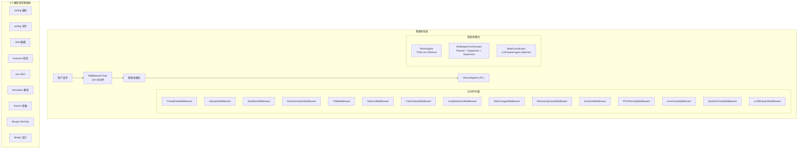
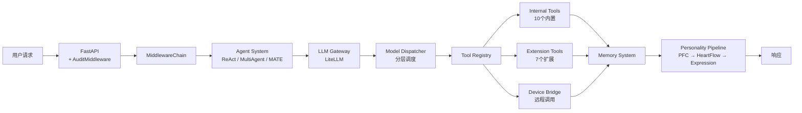
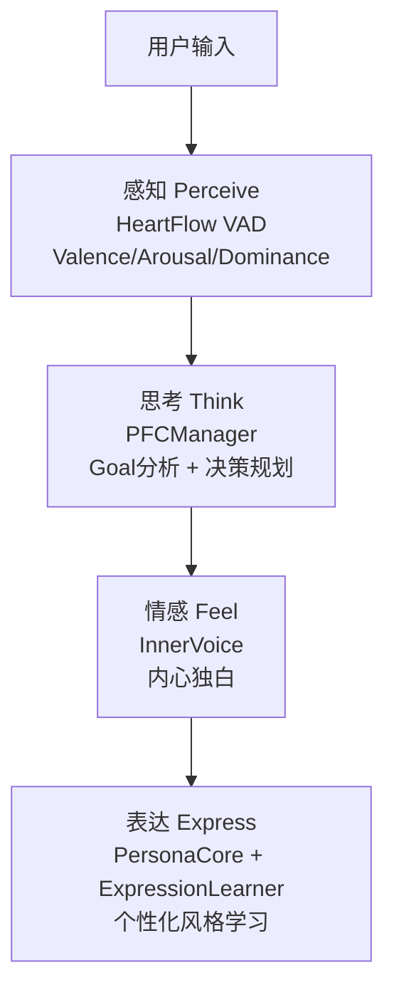
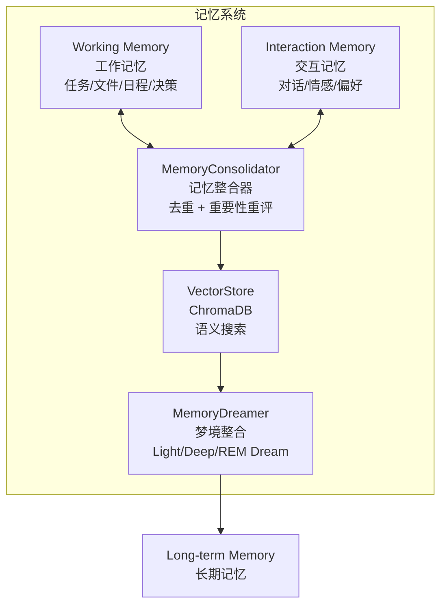
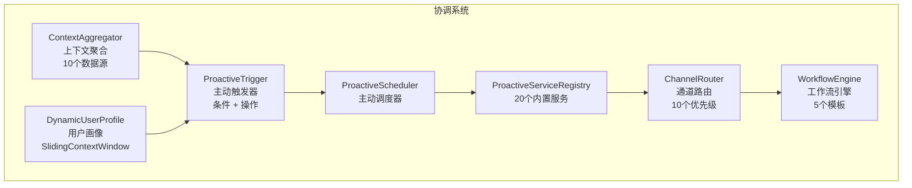
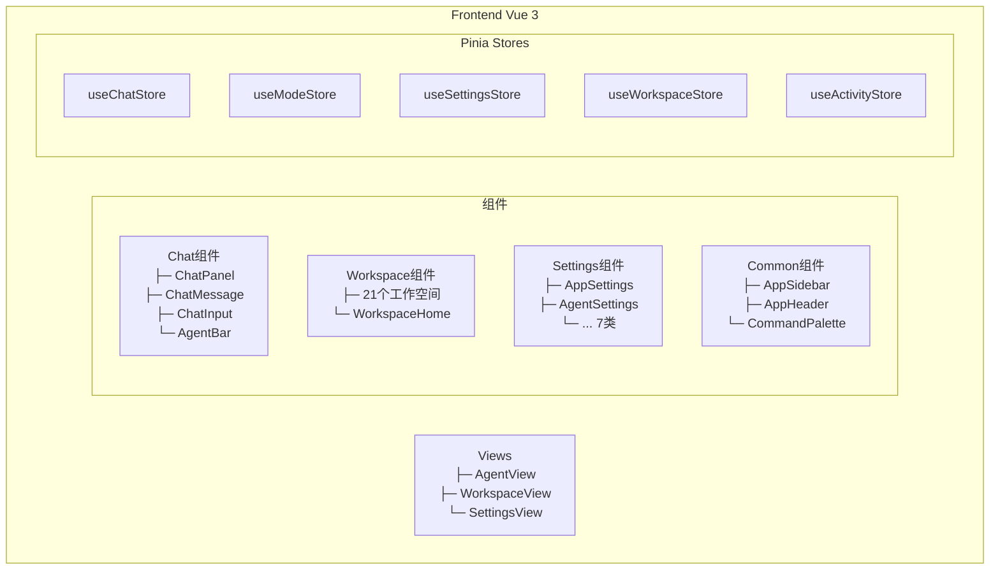
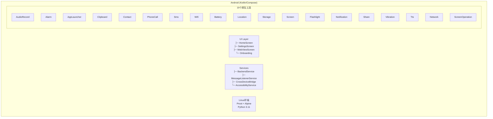
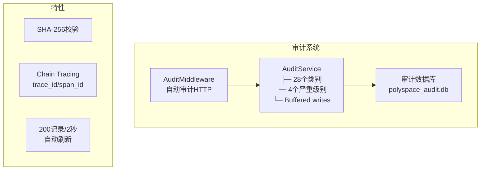

# PolySpace 项目架构图

## 整体架构

```mermaid
graph TB
    subgraph UI["用户界面层 User Interface Layer"]
        Web["Web 前端<br/>Vue 3 + Vite + Pinia<br/>21个工作空间组件"]
        Android["Android 客户端<br/>Kotlin + Jetpack Compose<br/>19个原生工具 + Linux环境"]
        Desktop["Desktop 客户端<br/>Electron + robotjs<br/>Windows自动化"]
    end

    subgraph Backend["后端层 Backend Layer - Python/FastAPI"]
        API["API 路由层<br/>REST API (25个路由组)<br/>WebSocket (/ws)"]

        subgraph Core["核心模块 Core Modules"]
            Agent["Agent 代理系统<br/>├─ ReActAgent (单智能体)<br/>├─ MultiAgentOrchestrator (多智能体)<br/>├─ MateCoordinator (MATE模式)<br/>├─ MiddlewareChain (15个中间件)<br/>└─ VerticalAgents (9个垂直领域)"]
            Memory["Memory 记忆系统<br/>├─ MemoryManager (记忆管理)<br/>├─ DualMemory (工作+交互)<br/>├─ VectorStore (ChromaDB)<br/>└─ MemoryDreamer (梦境整合)"]
            LLM["LLM 模型层<br/>├─ LLMGateway (LiteLLM)<br/>└─ ModelDispatcher (分层调度)"]
            Tool["Tool 工具系统<br/>├─ ToolRegistry (注册表)<br/>├─ BaseTool (状态机)<br/>├─ InternalTools (10个内置)<br/>└─ ExtensionTools (7个扩展)"]
            Skills["Skills 技能系统<br/>├─ SkillLoader (YAML加载)<br/>├─ SkillAdapter (工具适配)<br/>└─ AnimationEngine (SVG动画)"]
            Personality["Personality 人格系统<br/>├─ PFCManager (决策)<br/>├─ HeartFlow (情感VAD)<br/>├─ ExpressionLearner (表达学习)<br/>└─ GreetingManager (问候)"]
            Safety["Safety 安全系统<br/>├─ PolicyEngine (策略引擎)<br/>└─ RuntimeMonitor (运行时监控)"]
            Connector["Connector 连接器<br/>├─ DeviceManager (设备管理)<br/>├─ Android/Win/Web Bridge<br/>└─ CrossDeviceSync"]
            Coordination["Coordination 协调系统<br/>├─ ContextAggregator (上下文)<br/>├─ ProactiveScheduler (主动调度)<br/>├─ ChannelRouter (通道路由)<br/>└─ WorkflowEngine (工作流)"]
            Audit["Audit 审计系统<br/>├─ AuditMiddleware (中间件)<br/>├─ AuditService (28类别)<br/>└─ SHA-256 + 链式追踪"]
            MCP["MCP 协议<br/>├─ MCPAdapter (适配器)<br/>└─ MCPClient (客户端)"]
            Other["其他模块<br/>├─ Inference (本地推理)<br/>├─ Vertical/Finance (垂直领域)<br/>└─ Hub (中心连接)"]
        end

        subgraph Services["服务层 Services Layer (28个服务)"]
            ChatService["ChatService"]
            WorkspaceService["WorkspaceService"]
            EmailService["EmailService"]
            KanbanService["KanbanService"]
            BrowserService["BrowserService"]
            SyncService["SyncService"]
            CoordinationService["CoordinationService"]
            OtherServices["...其他21个服务"]
        end
    end

    subgraph Data["数据层 Data Layer"]
        SQLite["SQLite (aiosqlite)<br/>主库 + 审计库"]
        ChromaDB["ChromaDB<br/>向量存储"]
        Files["文件系统<br/>d:/Polyspace/data/"]
    end

    UI --> API
    API --> Core
    Core --> Services
    Services --> Data
```

## API路由概览

```mermaid
graph LR
    subgraph APIGroups["25个API路由组"]
        CHAT["/api/v1/chat"]
        WORKSPACE["/api/v1/workspace"]
        TOOLS["/api/v1/tools"]
        MODELS["/api/v1/models"]
        SETTINGS["/api/v1/settings"]
        FILES["/api/v1/files"]
        SYNC["/api/v1/sync"]
        DASHBOARD["/api/v1/dashboard"]
        EMAIL["/api/v1/email"]
        KANBAN["/api/v1/kanban"]
        AI_WORKSPACE["/api/v1/ai/workspace"]
        AI_COORD["/api/v1/ai/coordination"]
        DEVICES["/api/v1/devices"]
        AUDIT["/api/v1/audit"]
        SEARCH["/api/v1/search"]
        RECORDINGS["/api/v1/recordings"]
        ARTIFACTS["/api/v1/artifacts"]
        RESEARCH["/api/v1/ai/research"]
        CLIPBOARD["/api/v1/clipboard"]
        VOICE["/api/v1/voice"]
        IM["/api/v1/im"]
        WEBHOOKS["/api/v1/webhooks"]
        AUTH["/api/v1/auth"]
        MARKETPLACE["/api/v1/marketplace"]
        PDF["/api/v1/pdf"]
    end

    WS["/ws (WebSocket)"]
```

## 智能体系统架构

```mermaid
flowchart TB
    subgraph AgentSystem["智能体系统"]
        Request["用户请求"] --> MiddlewareChain["MiddlewareChain<br/>15个中间件"]

        subgraph Middlewares["中间件列表"]
            TM["ThreadDataMiddleware"]
            UM["UploadsMiddleware"]
            SM["SandboxMiddleware"]
            SumM["SummarizationMiddleware"]
            TiM["TitleMiddleware"]
            TLM["TodoListMiddleware"]
            CM["ClarificationMiddleware"]
            LDM["LoopDetectionMiddleware"]
            TUM["TokenUsageMiddleware"]
            MemM["MemoryInjectionMiddleware"]
            EM["EmotionMiddleware"]
            PFCM["PFCPlanningMiddleware"]
            IVM["InnerVoiceMiddleware"]
            SPM["SystemPromptMiddleware"]
            LLMDM["LLMDispatchMiddleware"]
        end

        MiddlewareChain --> AgentMode["智能体模式"]

        subgraph AgentModes["智能体模式"]
            ReAct["ReActAgent<br/>Think-Act-Observe"]
            Multi["MultiAgentOrchestrator<br/>Planner + Dispatcher + Supervisor"]
            MATE["MateCoordinator<br/>LLM-based agent selection"]
        end

        AgentMode --> Vertical["VerticalAgents (9个)"]
    end

    subgraph VerticalAgents["9个垂直领域智能体"]
        C["coding 编码"]
        W["writing 写作"]
        D["data 数据"]
        R["research 研究"]
        S["seo SEO"]
        E["education 教育"]
        F["finance 金融"]
        O["devops DevOps"]
        DS["design 设计"]
    end
```

## 数据流向

```mermaid
flowchart LR
    Request["用户请求"] --> FastAPI["FastAPI<br/>+ AuditMiddleware"]
    FastAPI --> Middleware["MiddlewareChain"]
    Middleware --> Agent["Agent System<br/>ReAct / MultiAgent / MATE"]
    Agent --> LLM["LLM Gateway<br/>LiteLLM"]
    LLM --> Dispatch["Model Dispatcher<br/>分层调度"]
    Dispatch --> Tools["Tool Registry"]
    Tools --> Internal["Internal Tools<br/>10个内置"]
    Tools --> Extended["Extension Tools<br/>7个扩展"]
    Tools --> Bridge["Device Bridge<br/>远程调用"]
    Internal --> Memory["Memory System"]
    Extended --> Memory
    Bridge --> Memory
    Memory --> Personality["Personality Pipeline<br/>PFC → HeartFlow → Expression"]
    Personality --> Response["响应"]
```

## 人格系统管道

```mermaid
flowchart TB
    Input["用户输入"] --> Perceive["感知 Perceive<br/>HeartFlow VAD<br/>Valence/Arousal/Dominance"]
    Perceive --> Think["思考 Think<br/>PFCManager<br/>Goal分析 + 决策规划"]
    Think --> Feel["情感 Feel<br/>InnerVoice<br/>内心独白"]
    Feel --> Express["表达 Express<br/>PersonaCore + ExpressionLearner<br/>个性化风格学习"]
```

## 记忆系统

```mermaid
flowchart TB
    subgraph MemorySystem["记忆系统"]
        WM["Working Memory<br/>工作记忆<br/>任务/文件/日程/决策"]
        IM["Interaction Memory<br/>交互记忆<br/>对话/情感/偏好"]
        Consolidator["MemoryConsolidator<br/>记忆整合器<br/>去重 + 重要性重评"]
        VectorStore["VectorStore<br/>ChromaDB<br/>语义搜索"]
        Dreamer["MemoryDreamer<br/>梦境整合<br/>Light/Deep/REM Dream"]
    end

    WM <--> Consolidator
    IM <--> Consolidator
    Consolidator --> VectorStore
    VectorStore --> Dreamer
    Dreamer --> LongTerm["Long-term Memory<br/>长期记忆"]
```

## 协调系统 (Coordination)

```mermaid
flowchart TB
    subgraph Coordination["协调系统"]
        Context["ContextAggregator<br/>上下文聚合<br/>10个数据源"]
        Profile["DynamicUserProfile<br/>用户画像<br/>SlidingContextWindow"]
        Trigger["ProactiveTrigger<br/>主动触发器<br/>条件 + 操作"]
        Scheduler["ProactiveScheduler<br/>主动调度器"]
        Registry["ProactiveServiceRegistry<br/>20个内置服务"]
        Channel["ChannelRouter<br/>通道路由<br/>10个优先级"]
        Workflow["WorkflowEngine<br/>工作流引擎<br/>5个模板"]
    end

    Context --> Trigger
    Profile --> Trigger
    Trigger --> Scheduler
    Scheduler --> Registry
    Registry --> Channel
    Channel --> Workflow
```

## 前端组件结构

```mermaid
graph TB
    subgraph Frontend["Frontend Vue 3"]
        Views["Views<br/>├─ AgentView<br/>├─ WorkspaceView<br/>└─ SettingsView"]

        subgraph Components["组件"]
            Chat["Chat组件<br/>├─ ChatPanel<br/>├─ ChatMessage<br/>├─ ChatInput<br/>└─ AgentBar"]
            Workspace["Workspace组件<br/>├─ 21个工作空间<br/>└─ WorkspaceHome"]
            Settings["Settings组件<br/>├─ AppSettings<br/>├─ AgentSettings<br/>└─ ... 7类"]
            Common["Common组件<br/>├─ AppSidebar<br/>├─ AppHeader<br/>└─ CommandPalette"]
        end

        subgraph Stores["Pinia Stores"]
            ChatStore["useChatStore"]
            ModeStore["useModeStore"]
            SettingsStore["useSettingsStore"]
            WorkspaceStore["useWorkspaceStore"]
            ActivityStore["useActivityStore"]
        end
    end
```

## Android 客户端架构

```mermaid
flowchart TB
    subgraph Android["Android (Kotlin/Compose)"]
        UI["UI Layer<br/>├─ HomeScreen<br/>├─ SettingsScreen<br/>├─ WebViewScreen<br/>└─ Onboarding"]

        subgraph NativeTools["19个原生工具"]
            AT1["AudioRecord"]
            AT2["Alarm"]
            AT3["AppLauncher"]
            AT4["Clipboard"]
            AT5["Contact"]
            AT6["PhoneCall"]
            AT7["Sms"]
            AT8["Wifi"]
            AT9["Battery"]
            AT10["Location"]
            AT11["Storage"]
            AT12["Screen"]
            AT13["Flashlight"]
            AT14["Notification"]
            AT15["Share"]
            AT16["Vibration"]
            AT17["Tts"]
            AT18["Network"]
            AT19["ScreenOperation"]
        end

        Services["Services<br/>├─ BackendService<br/>├─ MessageListenerService<br/>├─ CrossDeviceBridge<br/>└─ AccessibilityService"]

        Linux["Linux环境<br/>Proot + Alpine<br/>Python 3.11"]
    end
```

## 审计系统

```mermaid
flowchart TB
    subgraph Audit["审计系统"]
        Middleware["AuditMiddleware<br/>自动审计HTTP"]
        Service["AuditService<br/>├─ 28个类别<br/>├─ 4个严重级别<br/>└─ Buffered writes"]
        DB["审计数据库<br/>polyspace_audit.db"]
    end

    Middleware --> Service
    Service --> DB

    subgraph Features["特性"]
        SHA["SHA-256校验"]
        Chain["Chain Tracing<br/>trace_id/span_id"]
        Flush["200记录/2秒<br/>自动刷新"]
    end
```
